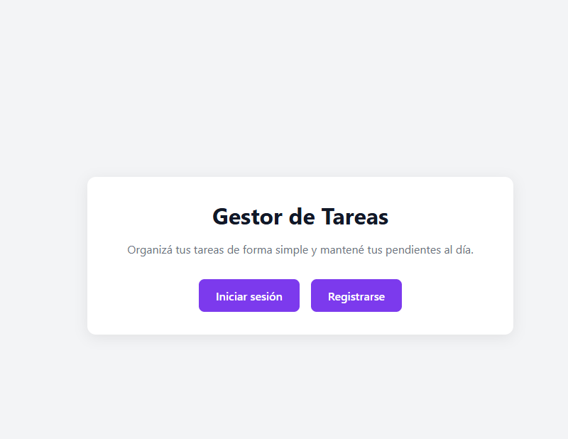
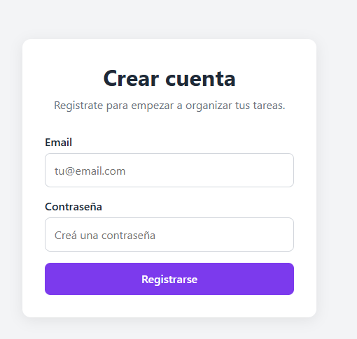
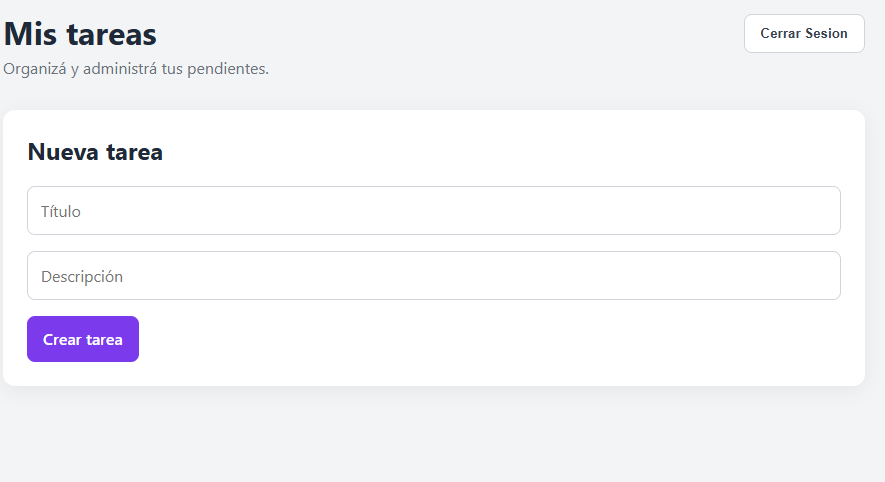

# Gestor Estratégico de Tareas

Proyecto Integrador del Módulo 4 de Desarrollo Full Stack en Henry.

La aplicación permite a los usuarios registrarse, iniciar sesión y administrar sus tareas personales mediante una aplicación desarrollada con React y TypeScript.

Cada usuario puede crear, visualizar, actualizar y eliminar sus propias tareas, almacenadas de forma persistente en Firebase Firestore.

## 🚀 Aplicación desplegada

https://proyecto-m4-sebastian-machello.vercel.app


## 📂 Repositorio

https://github.com/sebamachello/ProyectoM4_SebastianMachello-.git

## Funcionalidades

- Registro de usuarios.
- Inicio y cierre de sesión.
- Persistencia de sesión con Firebase Authentication.
- Rutas protegidas.
- Creación de tareas.
- Visualización de tareas.
- Actualización del estado de las tareas.
- Eliminación de tareas.
- Persistencia de datos mediante Firestore.
- Sincronización de tareas en tiempo real.
- Separación de tareas por usuario.
- Reglas de seguridad en Firestore.
- Navegación SPA con React Router.
- Aplicación desplegada en Vercel.
- Notificaciones por correo electrónico al crear tareas.
- Integración con Amazon SES mediante una función serverless en Vercel.

## Tecnologías utilizadas

- React
- TypeScript
- Vite
- React Router
- Firebase Authentication
- Cloud Firestore
- Vitest
- React Testing Library
- Vercel
- Amazon SES
- AWS SDK
- Vercel Functions

## Instalación

Clonar el repositorio:

```bash
git clone https://github.com/sebamachello/ProyectoM4_SebastianMachello-.git
```

Entrar al proyecto:

```bash
cd gestor-tareas
```

Instalar las dependencias:

```bash
npm install
```

## Variables de entorno

Crear un archivo `.env` en la raíz del proyecto utilizando como referencia `.env.example`.

```env
VITE_FIREBASE_API_KEY=
VITE_FIREBASE_AUTH_DOMAIN=
VITE_FIREBASE_PROJECT_ID=
VITE_FIREBASE_APP_ID=

AWS_ACCESS_KEY_ID=
AWS_SECRET_ACCESS_KEY=
AWS_REGION=
SES_FROM_EMAIL=

Las variables de Firebase son utilizadas por el frontend.

Las variables de AWS son utilizadas únicamente por la función serverless y deben configurarse de forma segura en Vercel. Las credenciales de AWS no se exponen en el frontend.
```

Los valores deben corresponder a la configuración del proyecto de Firebase.

El archivo `.env` no debe subirse al repositorio.

## Ejecutar el proyecto localmente

```bash
npm run dev
```

## Testing

Para ejecutar las pruebas:

```bash
npm test
```

El proyecto incluye pruebas realizadas con Vitest y React Testing Library, utilizando mocks para aislar dependencias cuando es necesario.

## Build

Para generar el build de producción:

```bash
npm run build
```

## Deploy

La aplicación está desplegada en Vercel.

Las variables de entorno necesarias para Firebase deben configurarse también dentro del proyecto en Vercel.

Se utiliza `vercel.json` para redirigir las rutas de la SPA hacia `index.html`, permitiendo acceder y recargar directamente rutas como `/tasks`.

## Seguridad

Las reglas de Firestore restringen el acceso a las tareas según el usuario autenticado.

Cada tarea almacena el `userId` del usuario que la creó, evitando que otros usuarios puedan acceder o modificar sus datos.

Las credenciales y variables sensibles no se almacenan directamente en el código fuente.

Las credenciales de AWS SES se almacenan como variables de entorno del servidor en Vercel y no utilizan el prefijo `VITE_`, evitando su exposición en el frontend.

## Uso de Inteligencia Artificial

Durante el desarrollo utilicé inteligencia artificial como herramienta de apoyo para recibir explicaciones, comprender conceptos y orientarme ante errores o dificultades.

La implementación y las decisiones del proyecto fueron realizadas por mí a partir de estas explicaciones y de los conocimientos adquiridos durante el módulo.

La IA fue utilizada principalmente como herramienta de aprendizaje y revisión durante el proceso de desarrollo.

## Capturas

### Inicio



### Autenticación




### Gestión de tareas



## Estado del proyecto

## Estado del proyecto

Actualmente se encuentran implementadas la autenticación, protección de rutas, persistencia en Firestore, CRUD de tareas, sincronización en tiempo real, testing, deployment en Vercel y notificaciones por correo electrónico mediante Amazon SES.

Al crear una nueva tarea, la aplicación utiliza una función serverless en Vercel para enviar una notificación al correo electrónico del usuario autenticado mediante Amazon SES.


## Autor

Sebastián Machello

Proyecto Integrador — Desarrollo Full Stack — Henry